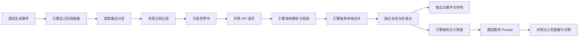

# 世界引擎插件：多引擎架构说明

这是一个运行在 SillyTavern 中的纯前端多引擎扩展。目前包含：

- **世界引擎**：维护独立于玩家视角的世界状态，并持续推演事件、势力、舆情、经济等变化。
- **记忆引擎**：提取人物主观记忆，以及组织、物件、能力、地点四类实体的当前描述和新增事件；本地累积历史并按名称命中注入。

本文主要写给后续开发者。重点不是功能宣传，而是说明哪些机制共用、哪些数据必须隔离、两个现有引擎如何工作，以及怎样继续加入第三个引擎。

## 一、共用部分

### 1. 核心原则：机制共用，配置与数据分离

“共用”不等于两个引擎读写同一份状态。

| 类型 | 当前做法 |
|---|---|
| 完全共用的实现 | 模块加载、底层存储、OpenAI 兼容 API 请求、超时/中止、正则校验与过滤、世界书读取、聊天上下文、基础存档交互、面板外壳 |
| 共用机制但数据不同 | API 配置、引擎总开关、运行模式、状态、检查点、世界书选择、云端实时缓冲、命名存档、主题、调试记录、注入内容 |
| 引擎独有 | Prompt、API 返回格式、JSON 校验、状态合并规则、运行节奏、重推语义、注入内容的选择与格式 |

必须保持以下隔离：

| 项目 | 世界引擎 | 记忆引擎 |
|---|---|---|
| 设置键 | `world_engine_settings` | `memory_engine_settings` |
| 本地状态 | `world_engine_<chatId>` | `memory_engine_state_<chatId>` |
| 本地检查点 | `world_engine_<chatId>_checkpoint` | 新式节点链可重放；`memory_engine_checkpoint_<chatId>` 仅兼容旧存档 |
| 世界书选择 | `world_engine_worldbook_selection_<chatId>` | `memory_engine_worldbook_selection_<chatId>` |
| `chat_metadata` 命名空间 | `world_engine` | `memory_engine` |
| 注入名称 | `world-engine-world` | `memory-engine-memory` |
| 注入哨兵 | `【世界信息】` | `【记忆信息】` |
| 总开关 | `world_engine_settings.engineEnabled` | `memory_engine_settings.engineEnabled` |

因此两个引擎可以使用不同 API、模型、温度和 Key；可以分别启停、分别同步、分别恢复存档，互不覆盖。

当前世界与记忆是两条独立运行链：

```text
世界设置/API → 世界 Prompt → 世界 JSON 解析与状态存储 → world-engine-world 注入
记忆设置/API → 记忆 Prompt → 人物与实体 JSON 解析、本地归并存储 → memory-engine-memory 注入
```

两边可以填写相同或不同的 API Key。相同 Key 只会共享上游账户的额度、并发和限速，不会在插件本地抢占请求、串用返回结果或覆盖注入；两个注入槽可以同时存在于酒馆最终 Prompt 中。

### 2. 启动、优先级与故障隔离

入口是 `world-engine.js`。引擎通过 `ENGINE_MODULE_GROUPS` 按注册顺序加载，彼此地位并列；世界引擎排在第一位，仅表示启动发生取舍时优先保证世界引擎，不表示其他引擎从属于世界引擎。

当前顺序是：

1. 加载 `SHARED_MODULES` 共用底座；底座失败会影响所有依赖它的引擎。
2. 按顺序加载 `ENGINE_MODULE_GROUPS`：世界组第一、记忆组第二，今后的引擎继续向后注册。
3. 每个引擎组分别捕获加载错误；记忆组失败不阻断世界，世界组失败也不会阻止已经具备共用底座的其他引擎尝试启动。
4. 加载共用诊断与 UI 外壳。
5. 调用 `WORLD_ENGINE_STORE.hydrate()`，再初始化聊天缓存和只读注入检查器。
6. 正常情况下先绑定世界事件、完成世界首次注入，再初始化记忆事件与首次注入。

模块都是 IIFE，通过 `window.*` 暴露接口，没有打包器或构建步骤。新增引擎应在 `ENGINE_MODULE_GROUPS` 中注册独立分组，不应把自己的文件塞进其他引擎分组。

故障边界遵循以下原则：

- Store、API 请求器、酒馆上下文、事件总线和面板外壳等真正的共用底座发生错误时，多个引擎可以共同受影响。
- 某个引擎自己的文件加载、初始化、事件回调、缓存 scope、页面 `render/bind` 或业务数据发生错误时，只允许该引擎降级。
- 每个引擎组加载后必须通过 `window.*` 接口契约校验；不能把 `script.onload` 直接等同于模块可运行。
- 世界事件先于记忆事件注册；所有引擎统一通过 `WORLD_ENGINE_GUARD_EVENT` 捕获同步异常和 Promise rejection。
- 共用聊天缓存调用各引擎 scope 时必须分别捕获异常；一个 scope 失败不能跳过世界 scope。
- `WORLD_ENGINE_CHATCACHE` 自己监听 `CHAT_LOADED` 并先恢复各 scope，不能依赖世界引擎代为驱动生命周期。
- 共用 UI 调用引擎的主题、状态、渲染、绑定及 `forward/redo/abort/setEnabled` 动作时必须经过隔离层。
- 目前尚未注册的 worldbook/cache/diag/inspector scope 必须明确报错，禁止静默回退到 world 串用数据。

新增第三个引擎时同样遵守这些边界，不为它复制 Store、API、聊天缓存或面板外壳。

### 3. 共用执行骨架

两个引擎虽然业务不同，但都沿着同一条骨架工作：



共用的是基础设施；从“解析 API 返回”开始，必须由各引擎自己负责。

### 4. 共用模块

#### `world-engine-store.js`

所有持久化数据的底层入口：

```js
WORLD_ENGINE_STORE.hydrate()
WORLD_ENGINE_STORE.getItem(key)
WORLD_ENGINE_STORE.setItem(key, value)
WORLD_ENGINE_STORE.removeItem(key)
WORLD_ENGINE_STORE.keys()
WORLD_ENGINE_STORE.setSyncSink(sink)
```

优先使用 IndexedDB，失败时回退到 `localStorage`。上层模块仍可同步读写，因为实际读取走内存镜像。

新引擎不要直接新建另一套 IndexedDB；为自己的状态设计独立 key，并继续使用该模块。

#### `world-engine-api.js`

共用 OpenAI 兼容请求实现，支持浏览器直连和 SillyTavern 服务端代理：

```js
WORLD_ENGINE_API.callApi(prompt, maxTokens, temperature, signal, settingsOverride)
WORLD_ENGINE_API.fetchModelList(settingsOverride)
```

关键点是第五个参数 `settingsOverride`。新引擎必须显式传入自己的设置，不能依赖世界引擎默认配置，否则会错误复用世界引擎的 URL、Key 或模型。

当前 `callApi` 把传入字符串作为一条 `user` message 发送。世界引擎和记忆引擎都将完整系统要求与请求正文拼成这个字符串。

#### `world-engine-core.js`

这是一个混合模块：大部分内容属于世界状态，但以下能力可供其他引擎复用：

- `getChatId()`、`getChatLayer()`：当前聊天标识与楼层。
- `filterDialogue(text, settings)`：在送往后台前过滤对话。
- `validateFilterRegex(raw)`：校验设置中的逐行正则。
- `parseStoryDay()` 等故事时间辅助方法。

过滤器读取的字段名是 `settings.evolveFilterRegex`。记忆引擎的设置字段叫 `filterRegex`，调用时会适配为：

```js
WORLD_ENGINE_CORE.filterDialogue(text, {
  evolveFilterRegex: memorySettings.filterRegex,
});
```

不要把第三个引擎的业务状态塞入 `WORLD_ENGINE_CORE`。应建立自己的 `<id>-engine-data.js`。

#### `world-engine-worldbook.js`

世界书读取与蓝/绿灯触发逻辑共用，当前世界与记忆的选择记录按 scope 分离：

```js
await WORLD_ENGINE_WORLDBOOK.buildPromptSection(scanText, scope)
```

- 世界引擎使用 `scope = "world"`。
- 记忆引擎使用 `scope = "memory"`。

每个引擎仍需自行决定世界书内容在 Prompt 中的权限。记忆引擎只允许世界书帮助识别人名、别名和背景，不允许把世界书直接当作新记忆。

重要限制：目前 `normalizeScope()`、存储前缀和触发设置只显式支持 `world/memory`；任何其他非空 scope 都会明确抛错，不再回退到 `world`。新增第三个引擎时，必须先在本模块增加独立前缀、scope 归一化和触发设置读取，之后才能使用例如 `"relationship"` 的 scope。

#### `world-engine-chatcache.js`

共用 `chat_metadata` 写入、Lamport 修订号、实时同步、命名存档、滚动备份、恢复/导入/导出等机制。

世界引擎直接使用：

```js
WORLD_ENGINE_CHATCACHE.createSnapshot(name)
WORLD_ENGINE_CHATCACHE.restoreSnapshot(id)
```

记忆引擎通过独立 scope 使用同一套交互：

```js
const cache = WORLD_ENGINE_CHATCACHE.forScope('memory');
cache.createSnapshot(name);
```

重要限制：目前 `forScope()` 只显式支持 `memory`，并非任意 scope 注册表。新增第三个引擎时，必须在本模块增加其独立 slots、设置读取和 `chat_metadata.<engineId>` 命名空间，或先把这里进一步重构为通用 scope 注册器。

任何 API Key、URL 等全局设置都不得写入 `chat_metadata`；这里只同步按聊天隔离的数据。

#### `world-engine-inject-inspector.js`

只读监听 SillyTavern 最终 Prompt 事件，用注入哨兵判断内容是否真正进入最终请求。它不会修改 Prompt 或状态。

目前检查器只认识世界和记忆两个注入名/哨兵。新增引擎时必须登记自己的：

- extension prompt 名称；
- 无宏、稳定、唯一的哨兵文本；
- 独立的最后快照。

#### `world-engine-diag.js`

收集设置（自动脱敏）、聊天统计、状态、检查点、API 调试、注入检查和正则诊断，并导出 JSON 诊断包。

目前 `collect(scope)` / `download(scope)` 只针对 `world` 和 `memory` 分支。第三个引擎必须补充自己的诊断数据源，不能只注册 UI。

#### `world-engine-ui.js`

共用面板外壳、设置页基础组件、主题、悬浮球和“切换到下一个引擎”注册表。

当前注册顺序为：

```text
world → memory → 回到 world
```

新增界面注册后会自动进入循环：

```text
world → memory → new_engine → 回到 world
```

面板顶部点击继续切换到下一引擎。悬浮球单击负责打开/关闭面板；环绕悬浮球的右下角第五颗卫星显示另一引擎的图标，单击可在世界引擎与记忆引擎之间直接切换。悬浮球不再使用双击切换。

记忆引擎提取运行时，指纹球保留呼吸发光，并播放指纹本体轻微浮动、扩散虚影和纹路内纵向扫描亮线；静止状态不播放，系统开启“减少动态效果”时自动停用动画。

公开接口：

```js
WORLD_ENGINE_UI.registerEngineFace(definition)
WORLD_ENGINE_UI.listEngineFaces()
WORLD_ENGINE_UI.advanceEngineFace()
```

可注册钩子如下：

```js
WORLD_ENGINE_UI.registerEngineFace({
  id: 'new_engine',                 // 必填；也是顺序与 scope 的稳定标识
  label: '新引擎',
  ballClass: 'we-ball-new-face',    // 可选：悬浮球样式
  panelClass: 'we-new-face',        // 可选：面板样式
  getTheme: () => 'night',
  getVersion: () => '0.1.0',
  getSettings: () => NEW_ENGINE_SETTINGS.getSettings(true),
  setEnabled: enabled => NEW_ENGINE_SETTINGS.patchSettings({ engineEnabled: enabled }),
  isRunning: () => NEW_ENGINE.isRunning(),
  render: () => NEW_ENGINE_UI.render(),
  bind: panel => NEW_ENGINE_UI.bind(panel),
  openSettings: () => NEW_ENGINE_UI.toggleSettings(),
  isSettingsOpen: () => NEW_ENGINE_UI.isSettingsOpen(),
  onSettingsTab: key => NEW_ENGINE_UI.setSettingsTab(key),
  refreshDebug: () => NEW_ENGINE_UI.refreshDebug(),
  showForward: false,
  forward: () => NEW_ENGINE.forward(),
  redo: () => NEW_ENGINE.redo(),
  abort: () => NEW_ENGINE.abort(),
});
```

除 `id` 外都可按需要提供。非世界引擎如果没有 `render`，面板会显示“尚未提供渲染器”。当前主题名由 `WE_THEMES` 白名单控制；需要新主题时还要扩展主题表和 CSS 变量。

### 5. 共用 SillyTavern 事件

两个引擎都会关注以下事件：

| 事件 | 用途 |
|---|---|
| `GENERATION_ENDED` / `MESSAGE_RECEIVED` | AI 完整回复落地后，判断是否自动运行 |
| `GENERATION_STARTED` | 正文组装前选择当前状态或检查点注入 |
| `MESSAGE_SWIPED` | 中止待执行任务，并按重 roll 语义注入检查点 |
| `CHAT_LOADED` | 清理旧计时器，恢复当前聊天状态并重新注入 |

调度器必须去重并支持 `AbortController`。不要让 swipe、regenerate 或重复事件被计算为新轮次。

## 二、世界引擎

### 1. 它是什么

世界引擎维护“当前世界如何运转”的结构化状态。它不是剧情摘要器，也不以玩家为中心；它负责事件链、势力、世界趋势、风声、声誉、经济、区域事件、影响链、宿敌和未公开信息等长期变化。

世界引擎由外部 LLM 与本地机制共同驱动：

- LLM 根据近期对话、旧世界状态、规则和世界书生成结构化更新。
- 本地机制负责骰子、事件阶段、冷却、概率、容量、ID、终局保留和合并约束。

### 2. 运行流程

1. `world-engine.js` 在 AI 回复完成后去重并等待 1500ms。
2. 根据 `evolveMode` 判断自动按轮、按故事时间或手动运行。
3. 读取最近若干轮对话，并用共用正则过滤。
4. `world-engine-evolution.js` 组合旧状态、规则、预设、世界书和对话。
5. 通过 `WORLD_ENGINE_API.callApi()` 请求结构化世界更新。
6. 校验、归一化并合并 LLM 返回；执行本地事件机制。
7. 推演前状态写入 checkpoint，推演后状态写入当前 state。
8. `world-engine-ledger.js` 记录重大变化。
9. `world-engine-inject.js` 压缩出正文所需的世界上下文。
10. 下一次生成前，以 `world-engine-world` 注册到酒馆 Prompt。

### 3. 世界状态

`WORLD_ENGINE_CORE.getDefaultState()` 的主要结构：

```js
{
  round: 0,
  worldDigest: '',
  events: [],
  factions: [],
  winds: [],
  worldTrends: [],
  reputation: {},
  economy: { climate: '', signals: [] },
  memories: [],          // 世界重大事件账本，不是人物记忆引擎
  enemies: [],
  influenceChain: [],
  regionalIncident: {},
  distantEvent: {},
  nearEvent: {},
  blackbox: { secretActions: [], secretAssets: [] },
  lastEvolveResult: null,
  lastInjection: null,
  lastUpdated: {}
}
```

持续实体使用分类 ID，例如 `event_000001`、`faction_000001`。ID 只需在当前时间线内唯一；恢复 checkpoint 后，编号从恢复状态继续。

### 4. 检查点与重 roll

世界引擎使用 A/B 双态：

- **当前状态 A**：上一轮成功推演后的世界。
- **检查点 B**：该次推演前的世界。

正常新生成注入 A；`swipe` / `regenerate` 注入 B。手动“重新推进”也以 B 为基底，避免把被重 roll 的结果继续累加。

重 roll 判据使用 SillyTavern `GENERATION_STARTED` 的 `type`，不能只比较楼层数，因为新一轮生成开始时用户/AI 楼层可能尚未 push 进 chat。

### 5. 世界引擎文件

| 文件 | 职责 |
|---|---|
| `world-engine.js` | 总入口，同时包含世界引擎调度与注入选择 |
| `world-engine-core.js` | 世界状态、检查点、实体 ID、导入导出、时间与过滤辅助 |
| `world-engine-evolution.js` | Prompt 组合、LLM 推演、本地机制、合并与批量重填 |
| `world-engine-rules-loader.js` | 内置世界运行规则 |
| `world-engine-preset.js` | 世界 Prompt 可编辑分段与预设 |
| `world-engine-ledger.js` | 重大世界变化账本 |
| `world-engine-inject.js` | 将庞大世界状态压缩成正文注入 |

## 三、记忆引擎

### 1. 它是什么

记忆引擎同时保存三类内容：人物主观认知、实体记忆和事件记忆。实体分为组织、物件、能力、地点；事件记忆由阶段性纪要与总述组成。人物/实体更新另外进入一条从 Root 向前追加的可重放时间链。

人物实体、小总结和大总结分别拥有独立 Prompt 与触发游标。人物实体与小总结同轮到期时可合并为一次 LLM 请求；小总结返回并落库后，再判断未合并数量，大总结始终使用独立的第二次请求且只发送大总结 Prompt。没有 embedding 或向量数据库。

### 2. LLM 输入与输出

`memory-engine-prompt.js` 负责固定 Prompt。输入包括：

- 当前可换算的绝对故事时间；
- 已知人物及别名；
- 已知的组织、物件、能力、地点名称与当前描述；
- 可选世界书背景；
- 过滤后的本轮对话；
- “本地机制”中配置的只读辅助参考：依次向前选取总述、纪要与近期正文，三段楼层范围不重叠；
- 用户设置的附加要求。

`memory-engine-small-summary-prompt.js` 每个 AI 回合生成一条 50–200 字的小总结，并与同轮人物/实体提取合并为一次请求。参考正文、纪要和总述只用于理解人物、指代与前因，不会扩大本轮提取范围。小总结保存后，`memory-engine-big-summary-prompt.js` 在未合并数量达到用户设置的 `bigSummaryEveryX` 条时，使用新增小总结生成大总结。批量总结回填另用 `summaryBackfillSmallEveryX` 与 `summaryBackfillBigEveryX`，不改变日常每轮处理规则。API 返回的纪要和总述正文由本地完整保存，不按提示目标字数二次截断。

API 必须返回一个 JSON 对象。`entity_updates` 是扁平更新数组，不返回本地 ID、索引或 `history`：

```json
{
  "personal_memory": [
    {
      "name": ["沈鹤亭", "沈先生"],
      "known_by": ["缔夜"],
      "memory": "沈鹤亭确信接天楼将成为势力枢纽。",
      "time": "嘉宁三十年正月十五 酉时三刻"
    }
  ],
  "entity_updates": [
    {
      "type": "object",
      "name": "断潮剑",
      "description": "一柄剑格刻有海浪纹的旧剑，目前剑身受损。",
      "event": "断潮剑在黑礁湾交战中折损。",
      "time": "嘉宁三十年正月十五"
    }
  ]
}
```

约束：

- `name` 是同一记忆持有者的明确名称/别名数组。
- `known_by` 只放正文明确知情的其他人物；持有者本人由本地补入。
- `memory` 是第三人称完整主观记忆，最多 50 字。
- `time` 只能是绝对故事时间，不能唯一换算时留空。
- 每人每批最多 3 条人物记忆，人物整批最多 8 条。
- `type` 只能是 `organization`、`object`、`ability`、`location`，分类边界由固定 Prompt 严格定义。
- `description` 是本批的当前状态更新，允许为空，非空时最多 200 字；非空值覆盖本地描述，空字符串表示不更新并保留原描述。
- `event` 是本批新增且值得长期保留的实体事件，允许为空，非空时最多 50 字。
- 实体 `time` 只对应 `event`；`event` 为空时也必须为空。
- 同一实体每批最多 3 项更新，全部实体更新合计最多 8 项。
- 兼容旧版只返回人物记忆 JSON 数组的 API 响应。

### 3. 本地状态

记忆引擎自己的状态位于 `MEMORY_ENGINE_DATA`：

```js
{
  personal_memory: [
    {
      id: 'char_000001',
      names: ['沈鹤亭', '沈先生'],
      memory: {
        '嘉宁三十年正月十五 酉时三刻': [
          '沈鹤亭确信接天楼将成为势力枢纽。'
        ],
        '': [
          '沈鹤亭怀疑有人隐瞒了关键情报。'
        ]
      }
    }
  ],
  knowledge_index: {
    '沈鹤亭': [
      { ownerId: 'char_000001', time: '...', memory: '...' }
    ],
    '缔夜': [
      { ownerId: 'char_000001', time: '...', memory: '...' }
    ]
  },
  entity_memory: {
    organization: [],
    object: [
      {
        id: 'obj_000001',
        name: '断潮剑',
        description: '一柄剑格刻有海浪纹的旧剑，目前剑身受损。',
        history: [
          { time: '嘉宁三十年正月十五', event: '断潮剑在黑礁湾交战中折损。' }
        ]
      }
    ],
    ability: [],
    location: []
  },
  entity_index: {
    'object:断潮剑': 'obj_000001'
  },
  event_memory: {
    small_summaries: [
      { id: 'small_000001', startLayer: 0, endLayer: 9, content: '……', sourceRefs: [], sourceDigest: '……', revision: 1 }
    ],
    big_summaries: [
      { id: 'big_000001', childIds: ['small_000001'], childDigest: '……', content: '……', revision: 1 }
    ],
    small_summary_layer: 9,
    big_summary_cursor: 1
  },
  timeline: {
    root: { base: { personal_memory: [], entity_memory: {}, round: 0 } },
    nodes: [
      { id: 'memory_000001', sourceRefs: [], sourceDigest: '……', personal: [], entities: {}, revision: 1 }
    ]
  },
  round: 1,
  chatLayer: 42
}
```

`personal_memory` 是权威人物记忆数据；`knowledge_index` 是本地检索索引，用来回答“当前出现的人物能读取哪些记忆”。持有者的所有别名与 `known_by` 中的明确知情人都会指向同一条记录。

`entity_memory` 是四类实体的权威本地数据；`entity_index` 是“类型 + 规范化名称 → 稳定 ID”索引。API 不生成 ID 或历史数组。本地按同类型同名归并：非空 `description` 覆盖当前描述，空描述保持不变；非空 `{time,event}` 去重追加进 `history`。

`timeline.root.base` 保存迁移/导入时的记忆基底；后续每次人物实体提取把原始 `personal_memory` 与 `entity_updates` 保存成节点。当前人物实体状态是 Root 顺序应用有效节点后的派生结果。每条聊天消息拥有插件稳定 ID；节点和纪要使用“聊天 ID + 消息 ID + swipe + 正文 hash”识别来源，不依赖会因删楼而移动的数字楼层。

没有时间的记忆使用空字符串键 `""`，注入时显示为“时间未明”。相互矛盾的记忆不会互相覆盖；完全相同的字符串会去重。

### 4. 运行与合并

1. 自动模式下每轮运行一次，或由设置按钮/记忆悬浮球的向前按钮手动触发。
2. 日常人物/实体提取与小总结固定只处理最新一轮，并在同轮合并为一次 API 请求；“本地机制”可总开关是否隐藏被摘要覆盖的正文，开启时默认保留最近 1 轮正文不隐藏，并额外读取 1 轮正文、5 条更早纪要与 1 条更早总述作为只读参考。
3. 复用正则过滤、可选世界书和 API 请求。
4. 校验顶层对象、字段类型、人物 50 字限制、实体描述 200 字限制、批次上限和相对时间。
5. 按名称或别名匹配已有角色；找不到时生成 `char_000001` 形式的 ID。
6. 把人物记忆追加到对应绝对时间键并更新 `knowledge_index`；实体由本地生成稳定 ID、更新描述、去重追加历史并更新 `entity_index`。
7. 把本批更新与正文来源写入时间链节点，更新派生状态、`round` 与 `chatLayer`；旧 checkpoint 只保留作兼容回退。
8. 独立触发记忆同步/备份与注入刷新。

小总结使用独立的 `small_summary_layer` 判断新增 AI 楼层；大总结使用 `small_summaries.length - big_summary_cursor` 判断尚未合并的数量。三类任务互不推进对方的游标。

手动向前提取以当前记忆状态为基底；重新推演优先替换时间链中的最近记忆节点，并从 Root 重放。只有尚未产生新式节点的旧存档才回退使用最近 checkpoint。

### 5. 记忆注入

生成前读取最近 `searchDepth` 层正文，用已知人物姓名/别名与实体名称扫描当前上下文。

只为命中的人物收集：

- 该人物自己的主观记忆；
- `known_by` 明确表示该人物知晓的其他人记忆。

每个人最多注入 `maxPerCharacter` 条，最终内容以 `【记忆信息】` 开头。其中人物条目只是人物认知，不代表客观真相。

事件记忆注入最近有效总述，以及没有被这些总述覆盖的有效纪要。总述失效时自动降级到仍然有效的子纪要，不继续注入旧总述。

开启“隐藏正文”后，被当前有效纪要/总述的 `sourceRefs` 明确覆盖、且不在“保留最近正文轮数”范围内的原始消息，才会通过 ST 原生 `/hide` 隐藏；关闭后恢复并保留全部正文，“保留最近正文轮数”不再参与判断。没有有效摘要来源覆盖的正文不会隐藏。重 Roll、正文编辑或删楼导致来源 hash 不一致时，生成拦截器先重做命中的纪要/记忆节点及祖先总述；修复失败则撤下失效摘要并恢复对应正文，避免摘要和正文同时缺失。

命中的实体会注入其分类、名称、当前描述，以及最多 `maxPerCharacter` 条最近历史；未在最近正文出现的实体不注入。

人物、实体、纪要与总述卡片均可通过标题栏箭头展开或收起；每次记忆 API 返回并完成本地解析落库后，当前打开的记忆面板会自动刷新，设置页或正在编辑的表单仍受防重绘保护。

关闭记忆总开关或“注入人物与实体记忆”后，只清理 `memory-engine-memory`，不会影响世界注入。

### 6. 重新推演、停止与重填

- **立即提取**：以当前记忆状态为基底，新增本批记忆。
- **重新推演记忆**：替换最近的时间链节点并从 Root 重放；旧存档才使用 checkpoint 兼容回退。
- **停止**：中止当前 `AbortController`，也可停止批量重填。
- **人物与实体重填**：只清空并重建人物、实体数据，保留大小总结。
- **大小总结重填**：只清空并从头重建事件记忆，保留人物、实体数据。
- **重 Roll/删楼对账**：按稳定消息 ID 与正文 hash 定位受影响轮次，立即从派生状态撤下该轮人物/实体贡献，并联合重做该轮人物/实体与小总结，再单独重做祖先总述；后续未变节点继续重放。
- **跨聊天继承**：导入或跨聊天恢复时把旧链的最终状态折叠为新聊天 Root，并把新聊天当前楼层设为新基线，避免重复提取旧聊天。

记忆首页以双层圆环展示客观总结进度：外圈是下一次小总结的 AI 楼层进度，内圈是下一次大总结所需的小总结数量进度。首页包含人物、实体、纪要与总述四个分页；人物和实体支持新增、修改、删除及明细编辑，纪要与总述只允许修改已有内容（可清空），不提供手动新增或删除入口。

世界与记忆的“常用”设置均提供独立的“首楼为 AI 开场白”选项，默认开启。开启时第 0 层不计入自动总结或批量重填；关闭时第 0 层按普通对话处理。

### 7. 记忆引擎文件

| 文件 | 职责 |
|---|---|
| `memory-engine-settings.js` | 独立设置与旧字段迁移 |
| `memory-engine-data.js` | 独立状态、检查点、导入导出 |
| `memory-engine-timeline.js` | 稳定消息身份、正文 hash、来源核对与正文隐藏 |
| `memory-engine-prompt.js` | 固定人物与世界实体记忆提取 Prompt、请求正文 |
| `memory-engine-small-summary-prompt.js` | 固定小总结 Prompt |
| `memory-engine-big-summary-prompt.js` | 固定滚动大总结 Prompt |
| `memory-engine.js` | 调度、API 调用、JSON 校验、本地归并、名称扫描、注入、重推与重填 |
| `fingerprint-outline-with-magnifying-glass-svgrepo-com.svg` | 记忆悬浮球图标 |

## 四、开发下一个引擎

### 1. 先定义业务边界

在写代码前明确：

1. 该引擎保存的是什么，权威含义是什么？
2. 一次 LLM 调用返回什么 JSON？
3. 哪些字段由 LLM 生成，哪些字段只能由本地生成？
4. 新结果是追加、覆盖、合并还是从 checkpoint 重算？
5. 什么情况下运行：每 X 轮、按时间、手动或其他事件？
6. 注入给谁、扫描什么、最多注入多少？
7. swipe / regenerate 时应使用当前状态还是 checkpoint？

如果这些问题没有先确定，不要从复制 UI 开始。

### 2. 推荐文件边界

```text
<id>-engine-settings.js   独立设置与默认值
<id>-engine-data.js       独立状态、检查点、导入导出
<id>-engine-prompt.js     独立 Prompt 与请求正文
<id>-engine.js            调度、解析、合并、注入、重推、重填
```

复杂引擎可以继续拆分规则、合并器或注入器；简单引擎不要复制整套世界引擎文件。

### 3. 必须独立命名

假设新引擎 ID 为 `relationship`：

```text
设置：relationship_engine_settings
状态：relationship_engine_state_<chatId>
检查点：relationship_engine_checkpoint_<chatId>
世界书：relationship_engine_worldbook_selection_<chatId>
云命名空间：chat_metadata.relationship_engine
注入名：relationship-engine-context
注入哨兵：【关系信息】
```

不要把新字段继续塞进 `world_engine_settings`，也不要复用世界或记忆的 checkpoint。

### 4. 可以直接复用

```js
const filtered = WORLD_ENGINE_CORE.filterDialogue(text, {
  evolveFilterRegex: settings.filterRegex,
});

// 只有在 world-engine-worldbook.js 已登记 relationship scope 后才能这样调用。
const worldbook = await WORLD_ENGINE_WORLDBOOK.buildPromptSection(filtered, 'relationship');

const raw = await WORLD_ENGINE_API.callApi(
  prompt,
  settings.maxTokens,
  settings.temperature,
  abortController.signal,
  settings,
);
```

同时复用 `WORLD_ENGINE_STORE`、SillyTavern 事件模式、`AbortController`、正则 UI、世界书 UI、导入导出交互和面板组件。

### 5. 不能直接复用

以下内容必须由新引擎定义：

- Prompt 与输出 schema；
- JSON 解析和严格校验；
- 本地 ID、去重、合并和容量规则；
- checkpoint 的业务语义；
- 注入筛选与注入文本；
- 调试记录中应展示的输入、原始返回和错误；
- 回填时如何切批、如何恢复、失败后保留什么。

### 6. 接入清单

1. 在 `world-engine.js` 的 `ENGINE_MODULE_GROUPS` 中注册独立引擎组，并在组内按依赖顺序排列模块；不要并入其他引擎组。
2. 初始化新引擎的 SillyTavern 事件监听。
3. 使用唯一 key 建立设置、状态和 checkpoint。
4. 扩展 `world-engine-worldbook.js` 的前缀、`normalizeScope()` 与触发设置，再使用唯一 scope。
5. 扩展 `world-engine-chatcache.js`，建立独立云 namespace 与 slots。
6. 扩展 `world-engine-inject-inspector.js`，登记注入名和哨兵。
7. 扩展 `world-engine-diag.js`，导出新引擎诊断。
8. 通过 `WORLD_ENGINE_UI.registerEngineFace()` 注册界面和悬浮球行为。
9. 为新引擎增加独立主题/图标样式；不要覆盖世界和记忆 class。
10. 验证新引擎关闭后不运行、不注入，同时不影响其他引擎。
11. 验证不同聊天、不同设备缓冲、命名存档和导入导出互不串数据。
12. 验证正常生成、swipe、regenerate、手动重推和回填。

### 7. 注册时机

`world-engine-ui.js` 当前最后加载。新运行模块可以先暴露：

```js
window.RELATIONSHIP_ENGINE = { /* ... */ };
window.RELATIONSHIP_ENGINE_UI = { /* ... */ };
```

等所有模块加载完成、`WORLD_ENGINE_UI` 可用后，再调用 `registerEngineFace()`。可以在 `world-engine.js` 初始化阶段注册，也可以把只负责注册界面的薄模块放在 `world-engine-ui.js` 之后加载。

仅注册 UI 代表“能切到该界面”，不代表缓存、诊断和注入检查已经自动支持；上述接入清单仍必须完成。

## 五、项目文件总览

```text
world-engine.js                         启动入口 + 世界引擎调度
world-engine-store.js                   共用持久化底层
world-engine-api.js                     共用 OpenAI 兼容请求
world-engine-core.js                    世界状态核心 + 共用聊天/过滤辅助
world-engine-worldbook.js               共用世界书机制，选择按 scope 分离
world-engine-chatcache.js               共用缓存机制，当前含 world/memory 两个 scope
world-engine-inject-inspector.js         共用只读注入检查，当前识别 world/memory
world-engine-diag.js                     共用诊断外壳，当前含 world/memory 分支
world-engine-ui.js                       共用面板外壳与引擎界面注册表
world-engine-evolution.js                世界引擎推演与本地机制
world-engine-rules-loader.js             世界引擎规则
world-engine-preset.js                   世界引擎 Prompt 预设
world-engine-ledger.js                   世界引擎重大变化账本
world-engine-inject.js                   世界状态注入构造
memory-engine-settings.js                记忆独立设置
memory-engine-data.js                    记忆独立状态与检查点
memory-engine-prompt.js                  记忆固定 Prompt
memory-engine.js                         记忆运行链
style.css                                面板、主题与悬浮球样式
worldmap.svg                             世界悬浮球素材
fingerprint-...svg                       记忆悬浮球素材
manifest.json                            SillyTavern 扩展清单与版本
```

## 六、安装与调试

### 安装

在 SillyTavern 扩展管理器中安装：

```text
https://github.com/DlSNlGHT/World
```

或放入：

```text
<SillyTavern>/data/default-user/extensions/world-engine
```

### 最低调试要求

每个引擎的调试页至少应能看到：

- 实际发送给后台 API 的完整 Prompt；
- API 原始返回；
- 注入检查结果；
- 脱敏诊断包；
- 正则有效/无效条目。

API Key 不得出现在日志、诊断包、导出状态或 `chat_metadata` 中。

## 许可证与作者

- License: MIT
- Author: [Disnight](https://github.com/DlSNlGHT)
